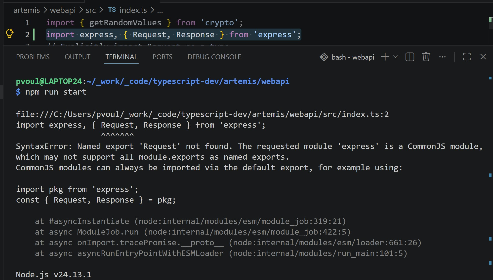
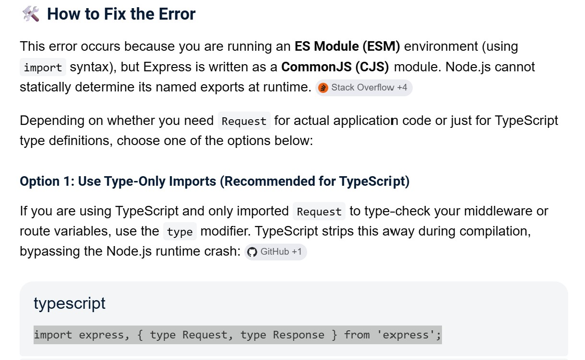

# TypeScript Notes

- `npm init -y`
  - Adds `package.json`
- `npm install typescript --save-dev`
  - Adds `typescript` to node_modules and `package.json`
- `npx tsc --init`
  - Adds `tsconfig.json`
- Install `tsx` and run `npx tsx src/index.ts`
- See [tsx](https://tsx.is/getting-started)

# TypeScript

- [TypeScript](https://www.typescriptlang.org/)
- [Introduction To TypeScript](https://nodejs.org/en/learn/typescript/introduction)
- Running `TypeScript` in [node](https://nodejs.org/en/learn/typescript/run)

# Working Log

## `Sunday, 6/7/26`

### Add `correlation` or `request` ID to log entries

- Added logic, but it looks like it's still not fully-functional
- Good enough for now.

### Configure everything to run locally in docker container

- Using `docker-compose up --build`
- It works!

### Send logs/output to `Seq`

- See [here](https://datalust.co/)
- `npm install pino-seq`
- Run `docker-compose up` in project directory
- Note `compose.yaml` is configured to run `seq` locally

### Implement Structured Logging

- Implement structured logging with [Pino](https://getpino.io/#/)
- Similar to `Serilog` in the dotnet space

```bash
npm install pino pino-http
npm install --save-dev pino-pretty
```

### Create initial express-based Hello World API

- Created `artemis\webapi` project
- Installed dependencies
- Install `express`:
  - `npm install express`
- Install dev dependencies:
  - `npm install --save-dev typescript @types/node @types/express ts-node nodemon`
- Encountered this error:



- And this fixed it:


